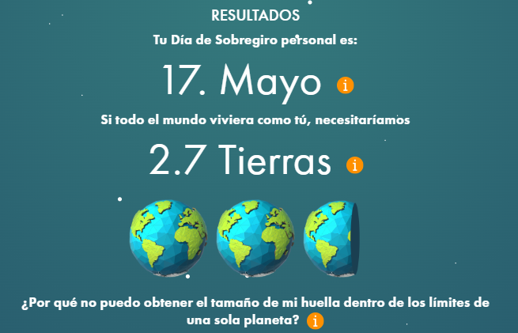
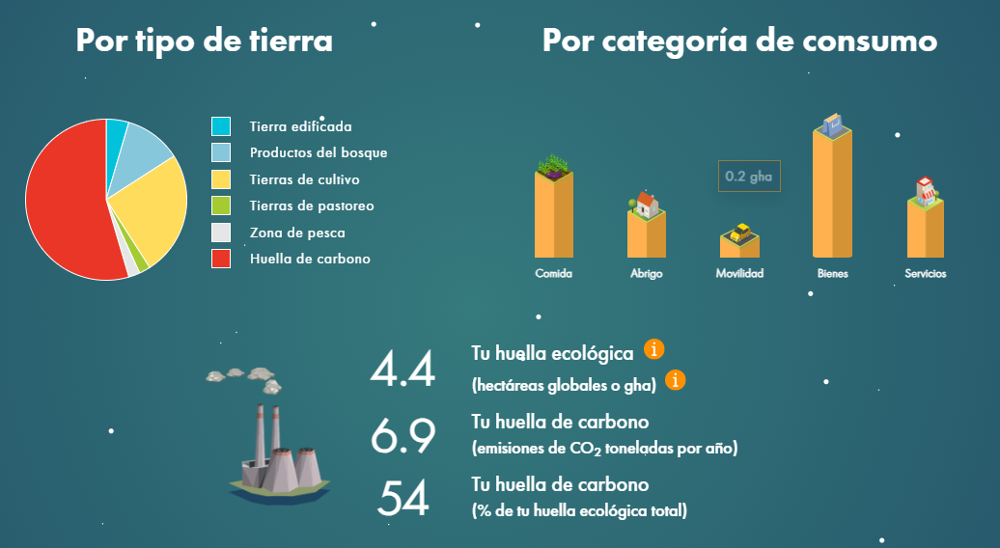

# Diciembre

## Clase 11

### Huella ecológica y de carbono
Hoy en la clase de Miguel hemos visto sobre la huella ecológica y la de carbono.

Una breve explicación:

Huella ecológica: Mide cuánta superficie de tierra y agua biológicamente productiva necesitamos para producir los 
recursos que consumimos. Se expresa en hectáreas globales (hag).

Huella de carbono: mide la cantidd total de gases de CO₂ que generamos. Se mide en toneladas de CO₂ 
equivalente.

La pregunta de hoy es hacer nuestra huella de carbono dentro de la pagina web footprint calculator: https://www.footprintcalculator.org/es/results/0/summary

Resultado:

# Noviembre

## Clase 10

### Ecomonia circular y lineal

Hoy con Miguel en clase hemos visto la economia circular, la economia linear y el eco diseño.

Economía circular:
- Busca minimizar residuos.
- Promueve reutilizar, reparar....
- Mantiene los materiales el mayor tiempo posible.

Economía lineal:
- Modelo tradicional: extraer, producir, usar, y tirar.
- Genera muchos residuos.

Ecodiseño:
- Diseña productos pensando en el medio ambiente, priorizando la durabilidad, reparación y eficiencia.
- Facilita el reciclaje y reduce el impacto ambiental.

La pregunta de hoy es: ¿Y a mí qué me cuentas? - ¿En qué nos afecta el ecodiseño? ¿Enfoque colectivo o individual?
Nos afecta porque hace que los productos sean más duraderos, reparables y eficientes, lo que nos permite ahorrar energía y dinero.
l ecodiseño también debería incluir un enfoque individual, porque las decisiones de consumo de cada persona 
influyen en que las empresas sean más sostenibles.

# Noviembre

## Clase 9

### ¿?

Hoy no vino Miguel. (Clase libre)

# Noviembre

## Clase 8

### El viaje de los productos

Hoy hemos visto en clase que cada objeto que fabricamos los humanos tiene un peso oculto detras. Hemos visto el ejemplo
de un dispositivo movil, que para crear 150g de dispositivo se necesita 80Kg de producción como: materiales, energia, 
CO2 depositado en la atmosfera...etc.

La pregunta de hoy es ¿Cuantas toneladas hay en el paso de distribución en al creación de un dispositivo movil?

Le he preguntado a ClaudeIA la siguiente info con este prompt:

Quiero esta información:
1. Top 5 de las cosas que más produce
2. Total
3. Formas de solucionarlo
4. Total con soluciones más eficientes

Respuesta de ClaudeIA:

    Basándome en los estudios de análisis del ciclo de vida (LCA) encontrados, te proporciono la información sobre las 
    emisiones de CO₂ en la fase de distribución/transporte de dispositivos móviles:
    
    EMISIONES EN LA FASE DE DISTRIBUCIÓN
    1. Top 5 de las cosas que más producen en la distribución:
       Según los análisis de ciclo de vida, el transporte final contribuye con aproximadamente 3 kg de CO₂e en el 
       ciclo de vida total (3 años), y los transportes relacionados con la producción representan 2.6 kg CO₂e adicionales 
       ResearchGate. Los principales componentes son:
    
    - Transporte marítimo transoceánico (China/Asia → Europa/América) - Mayor volumen
    - Transporte aéreo (para envíos urgentes o componentes específicos)
    - Transporte terrestre por camión (distribución local a tiendas)
    - Embalaje y packaging (producción y transporte del material de empaque)
    - Transporte de componentes durante manufactura (entre diferentes fábricas)
    
    2. Total de emisiones en distribución:
       La fase de distribución genera aproximadamente 1.9 kg CO₂eq por año cuando se asume un ciclo de reemplazo bienal 
       Wiley Online Library. Para un smartphone típico con vida útil de 2-3 años, esto representa entre 3.8 y 5.7 kg de CO₂e totales.
       Según datos de Apple para un iPhone 13 que emite 64 kg de CO₂ en su ciclo de vida completo: el 81% corresponde a 
       producción, 16% al uso, y el resto (aproximadamente 3%) a transporte y reciclaje Planete-energies, lo que equivale a 
       unos 2-3 kg de CO₂e solo para transporte.

    3. Formas de solucionarlo:
          Optimización del transporte:
    
    Aumentar el uso de transporte marítimo vs aéreo: pasar de 50% avión/50% barco a 30% avión/70% barco puede reducir significativamente las emisiones Fairphone
    Consolidar envíos y optimizar rutas logísticas
    Usar transporte eléctrico o híbrido para distribución local
    
    Producción regional:
    
    Establecer centros de ensamblaje más cerca de los mercados finales
    Reducir la distancia entre proveedores de componentes
    
    Diseño de packaging:
    
    Reducir peso y volumen del embalaje
    Usar materiales reciclados y biodegradables
    Optimizar el diseño para maximizar unidades por contenedor
    
    Economía circular:
    
    Fomentar mercado de segunda mano (evita nueva distribución)
    Programas de reacondicionamiento local
    La compra-venta de dispositivos reacondicionados generó en 2017 en México un ahorro de 49,303 toneladas de CO₂ BioPlanet
    
    4. Total con soluciones más eficientes:
       Aplicando las mejores prácticas:
    
    Escenario actual: ~3-5.7 kg CO₂e por dispositivo en distribución
    Con optimización de transporte (más marítimo, menos aéreo): Reducción del 30-50% → ~1.5-2.85 kg CO₂e
    Con producción regional + packaging optimizado: Reducción adicional del 20-30% → ~1.0-2.0 kg CO₂e
    Con economía circular (evitando nueva distribución): Reducción del 80-100% → ~0.2-1.0 kg CO₂e
    
    Resultado óptimo: Aproximadamente 1-2 kg CO₂e por dispositivo, lo que representa una reducción de 60-70% respecto al escenario actual.

# Octubre

## Clase 7

### Los recursos infinitos de la tierra

La finitud de recursos de la tierra es una de las principales razones por las que se quiere hacer de la tierra un lugar más sostenible. Por 
eso, aprender ahorrar recursos como el agua es algo importantisimo para la vida humana, además, hemos tenido que escoger un metodo de sostenibilidad de recursos.

## Clase 6

### Estrategias r y K

Hoy en clase de sostenibilidad, hemos visto las estrategias de reproducción r y k. Un puqueño resumen seria el siguiente

#### Estrategia r:
- **Características:**
    - Alta tasa de reproducción.
    - Poca inversión en el cuidado de las crías.
- **Ejemplos:** peces
- **Objetivo:** cantidad sobre calidad

#### Estrategia K:
- **Características:**
    - Baja tasa de reproducción.
    - Gran inversión de tiempo y recursos en el cuidado y desarrollo.
- **Ejemplos:**  seres humanos.
- **Objetivo:** calidad sobre cantidad.

La pregunta de hoy es: "¿Qué estrategia usamos los humanos?"

Los seres humanos utilizados una estrategia de reproducción K, puesto que nos enfocamos en cuidar a los niños, aunque tengamos pocos.

Un caso de estrategia r serian peces o anfibios, puesto que tienen muchas crias pero no los cuidan.

---

## Clase 5

### Vivimos solos... ¿verdad?

Hoy en la clase de Miguel hemos visto que los humanos son series sociales y que realizamos diferentes tipos de interacciones con los demas seres vivos: Intra y interespecificas.

Los seres vivos tambien colaboran entre ellos para conseguir un objetivo comun: *sobrevivir*. Hemos visto el caso de las trufas negras que hacen la simbiosis con los arboles, pero otro ejemplo puede ser el del pez payaso y la anemona.

La pregunta de hoy es: *¿Qué hacemos nosotros: cooperamos o competimos?*

El ser humano al ser un ser social quiere cooperar con la sociedad para conseguir un objetivo propio, pero a veces la cooperacion no es la unica forma de obtener un objetivo, sino que hay que competir.

Normalmente los humanos quieren obtener un beneficio propio, el cual otros humanos pueden tener el mismo objetivo, por lo cual cooperan para "derrotar" a otros humanos cuyo objetivo sea diferente o tenga otro punto de vista.

Un ejemplo puede ser un partido de baloncesto de la NBA. Los warriors son un equipo que *colaboran* para *competir* contra otro equipo como puede ser los Boston Celtics.

---

## Clase 4

### Limite de carga de los ecosistemas
Hoy hemos visto que es el límite de carga en clase, este se basa en el límite de individuos que puede tener un ecosistema sin que este se sobrecargue.

Cuando hablo de sobrecargar me refiero a la idea de que si una especie plorifera más que su límite, y en este no hay equilibrio, la especie tiene una tendencia a desaparecer.

La pregunta de hoy es: *¿Hay un límite para la población humana?*

En efecto, hay un límite de la población humana. Puesto que el ser humano necesita de multiples recursos para vivir de manera comoda y sencilla, hay un limite.

Este límite puede ser mayor o menor, eso no cabe duda, pero sín embargo, sabemos que ese límite existe. Si fuesemos conscientes con ello, estariamos pendientes de manera más constante sobre los efectos dañinos que realizamos a nuestros ecosistemas, por lo cual, estariamos más equilibrados mediante el límite hasta que haya una decadencia.

---

# Septiembre

## Clase 1

### Introducción de la asignatura

Hoy Miguel nos ha explicado de qué va a tratar la asignatura de Sostenibilidad de este año. Vamos a debatir ideas y hacer un diario para que quede constancia de ello.

También hemos hablado sobre el proyecto grupal, en el cual nuestra fila tiene que hablar sobre una civilización antigua.

---

## Clase 2

### ¿Qué es la sostenibilidad?

Hoy en clase, Miguel nos ha explicado el concepto de sostenibilidad y los tipos que este tiene. Además, hemos debatido en clase y hemos aclarado las ideas sobre la asignatura.

Las diferencias entre ecologismo y ecología también las hemos visto en clase y, al final, hemos seguido hablando sobre el proyecto grupal.

---

## Clase 3

### ¿Realmente somos animales?

Hoy en la clase con Miguel hemos visto por qué somos animales. Principalmente hemos aprendido que realizamos las tres funciones vitales y hemos hablado de las diferencias y similitudes que tenemos con ellos.

Miguel nos ha propuesto una pregunta: ¿Acabaremos con la vida de nuestro planeta? La respuesta es que sí.

Sabiendo las situaciones de guerra actuales, a cualquiera se le puede ir de las manos y lanzar una bomba nuclear reactiva. Esta se basa en que la bomba nuclear se potencia a través de reacciones nucleares hasta alcanzar una equivalencia en megatones suficiente como para partir la Tierra en dos. La potencia sería entre 1.500 y 3.500 megatones.